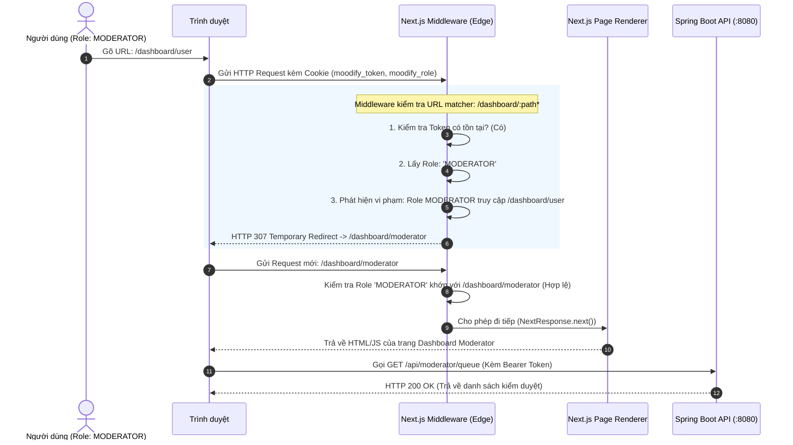

# Kiến Trúc Middleware và Bảo Vệ Route Phân Quyền (RBAC) - Moodify

Tài liệu giải thích lý do thiết kế, cơ chế hoạt động và cách triển khai Middleware trong hệ sinh thái **Moodify (Next.js Frontend + Spring Boot Backend)**.

---

## 1. Bối cảnh & Vấn đề thực tế

### 1.1 Hiện tượng
- Khi người dùng đăng nhập tài khoản có role **`MODERATOR`**, sau đó tự ý đổi đường dẫn URL trên trình duyệt thành:
  ```text
  http://localhost:3000/dashboard/user
  ```
- **Hiện tượng:** Trình duyệt vẫn tải và hiển thị khung giao diện (UI) của trang User Dashboard, mặc dù ở Backend Spring Boot đã cấu hình chỉ cấp quyền cho role `USER`.

### 1.2 Nguyên nhân gốc rễ
1. **Frontend và Backend chạy độc lập:**
   - Cổng `3000` (Next.js Frontend) và Cổng `8080` (Spring Boot API).
   - Khi gõ URL trên trình duyệt, trình duyệt gửi request trực tiếp đến **Server Next.js (port 3000)** để lấy mã HTML/JavaScript của Component. Lúc này **hoàn toàn chưa có bất kỳ request nào gửi sang Spring Boot (port 8080)**.
2. **Khung giao diện (Static Shell) được render trước API:**
   - Trong React/Next.js, cấu trúc trang (Header, Sidebar, Typography, Buttons) là mã JSX tĩnh đã được nạp sẵn.
   - Các hàm gọi API (lấy danh sách nhạc, thông tin cá nhân) chỉ chạy **sau khi** giao diện đã được vẽ lên màn hình (trong `useEffect` hoặc `Query Client`).
   - Lúc này Spring Boot Security mới nhận request và trả về HTTP `403 Forbidden`. Tuy nhiên, do Frontend không có cơ chế chặn chuyển trang từ trước, người dùng vẫn nhìn thấy giao diện trống / báo lỗi đỏ trong Console F12.

---

## 2. Vì sao hệ thống bắt buộc phải dùng Next.js Middleware?

Trong kiến trúc ứng dụng Web phân tán hiện đại, nguyên lý **"Defense-in-Depth" (Phòng thủ đa tầng)** được áp dụng:

| Tiêu chí | Spring Boot Security (Backend) | Next.js Middleware (Frontend) |
| :--- | :--- | :--- |
| **Phạm vi bảo vệ** | **Bảo vệ Dữ liệu (Data / API)** | **Bảo vệ Giao diện & Trải nghiệm (UI / UX)** |
| **Vị trí hoạt động** | Cổng `8080`, tại tầng Filter Chain trước Controller | Cổng `3000`, tại tầng Edge Server trước khi nạp Route |
| **Hành vi khi vi phạm** | Trả về mã lỗi HTTP `401 Unauthorized` hoặc `403 Forbidden` | Chuyển hướng tức thì (`Redirect`) về đúng Dashboard của role đó |
| **Độ trễ người dùng** | Phải chờ render xong, gọi API xong mới biết lỗi | **0ms:** Chặn ngay tại Server Edge trước khi render bất kỳ pixel nào |

### Lợi ích khi dùng Middleware:
1. **Không bị giật/chớp màn hình (No UI Flash):** Người dùng không thể nhìn thấy dù chỉ 1 frame hình ảnh của trang họ không có quyền.
2. **Bảo mật mã nguồn:** Trình duyệt không tải các JavaScript chunks / logic của trang bị cấm về máy client.
3. **Quản trị tập trung (Centralized):** Toàn bộ luật phân quyền (`/dashboard/user`, `/dashboard/moderator`, `/dashboard/artist`, `/dashboard/admin`) được quản lý duy nhất tại 1 file `middleware.ts`, không cần chèn code lặp lại ở từng trang `page.tsx`.

---

## 3. Cơ chế hoạt động của Middleware trong Moodify

### 3.1 Sơ đồ luồng xử lý (Workflow)



### 3.2 Quy tắc phân luồng (Routing Rules)

- **Chưa đăng nhập (Không có token):**
  - Mọi yêu cầu vào `/dashboard/:path*` đều bị chuyển hướng về trang chủ `/` kèm cờ `?auth=signin&redirect=...`.
- **Đã đăng nhập:**
  - `/dashboard` (root) $\rightarrow$ Tự động chuyển về dashboard đúng role (`/dashboard/{role}`).
  - `MODERATOR` vào `/dashboard/user`, `/dashboard/artist` $\rightarrow$ Redirect về `/dashboard/moderator`.
  - `ARTIST` vào `/dashboard/user`, `/dashboard/moderator` $\rightarrow$ Redirect về `/dashboard/artist`.
  - `USER` vào `/dashboard/moderator`, `/dashboard/artist`, `/dashboard/admin` $\rightarrow$ Redirect về `/dashboard/user`.
  - `ADMIN` có đặc quyền truy cập các dashboard quản trị.

---

## 4. Chi tiết triển khai kỹ thuật

### 4.1 Đồng bộ Cookie tại Client (`lib/auth/auth-client.ts`)
Next.js Middleware chạy tại môi trường **Edge Runtime (Server-side)** nên không thể đọc trực tiếp `localStorage`. Do đó, hệ thống đã bổ sung cơ chế đồng bộ token sang Cookie:

1. **Khi Đăng nhập (`saveAuthSession`):**
   - Lưu vào `localStorage` phục vụ cho các Client Component hiện tại.
   - Ghi cookie `moodify_token` (Access Token) và `moodify_role` (Role người dùng) với thời hạn tương ứng `expiresIn`.
2. **Khi Khởi động (`getStoredAuthSession`):**
   - Tự động kiểm tra và phục hồi Cookie nếu trình duyệt đã có session trong `localStorage` (giúp người dùng không bị văng ra sau khi cập nhật mã nguồn).
3. **Khi Đăng xuất (`clearAuthSession`):**
   - Xóa sạch cả `localStorage` và xóa Cookie (`max-age=0`).

### 4.2 Cấu hình Middleware (`middleware.ts`)
- Đặt tại thư mục gốc của frontend: `d:\Moodify\frontend\middleware.ts`.
- Sử dụng hàm giải mã Base64 an toàn để đọc payload JWT ngay trên Edge Runtime mà không cần thêm thư viện bên ngoài nặng nề.
- `matcher: ["/dashboard/:path*"]` đảm bảo Middleware chỉ kích hoạt khi người dùng truy cập khu vực Dashboard, không làm ảnh hưởng đến hiệu năng của các trang công khai (Home, Streaming, Search công khai).

---

## 5. Hướng dẫn nghiệm thu (Testing Checklist)

1. **Kiểm tra truy cập sai quyền:**
   - Đăng nhập tài khoản role `MODERATOR`.
   - Trên thanh địa chỉ, nhập: `http://localhost:3000/dashboard/user`.
   - **Kết quả mong muốn:** Trình duyệt lập tức chuyển hướng về `http://localhost:3000/dashboard/moderator`, không xuất hiện giao diện trang User.
2. **Kiểm tra chưa đăng nhập:**
   - Mở cửa sổ ẩn danh (Incognito), nhập: `http://localhost:3000/dashboard/moderator`.
   - **Kết quả mong muốn:** Trình duyệt chuyển hướng về trang chủ `http://localhost:3000/?auth=signin&redirect=/dashboard/moderator`.
3. **Kiểm tra đăng xuất:**
   - Bấm Đăng xuất từ Sidebar.
   - Kiểm tra Cookie `moodify_token` và `moodify_role` đã được dọn sạch.
